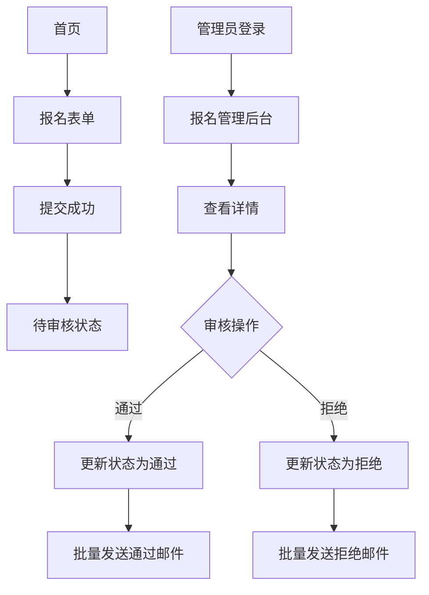

## 1. 产品概述
ICPC校赛报名网站系统是一个面向高校学生的算法竞赛报名平台，支持学生在线报名、管理员审核管理以及邮件通知功能。系统采用免服务器部署方案，确保快速上线和低成本运维。

目标用户为高校学生和竞赛管理员，解决传统纸质报名效率低、信息管理不便的问题，提供便捷的在线报名和审核流程。

## 2. 核心功能

### 2.1 用户角色
| 角色 | 注册方式 | 核心权限 |
|------|----------|----------|
| 学生用户 | 无需注册，直接填写报名表 | 提交报名信息、查看报名状态 |
| 管理员 | 预置账号登录 | 管理报名信息、审核、发送邮件通知 |

### 2.2 功能模块
系统包含以下核心页面：
1. **首页**：展示报名须知、立即报名按钮
2. **报名表单页**：填写个人信息、上传附件
3. **管理员登录页**：管理员身份验证
4. **报名管理后台**：报名列表、搜索筛选、详情查看、审核操作
5. **邮件模板设置**：编辑通过/拒绝邮件模板

### 2.3 页面详情
| 页面名称 | 模块名称 | 功能描述 |
|-----------|-------------|-------------|
| 首页 | 标题区域 | 显示"ICPC校赛报名"标题 |
| 首页 | 报名须知 | 展示可后台编辑的报名须知内容 |
| 首页 | 报名入口 | 立即报名按钮，跳转报名表单 |
| 报名表单页 | 基本信息 | 填写姓名、专业、学院、入学年份、邮箱、QQ号 |
| 报名表单页 | 个人简历 | 必填文本框，填写竞赛经历、获奖情况等 |
| 报名表单页 | 附件上传 | 非必填，支持多图片上传和在线预览 |
| 报名表单页 | 提交功能 | 提交后状态为"待审核" |
| 管理员登录页 | 登录表单 | 输入用户名密码进行身份验证 |
| 报名管理后台 | 报名列表 | 展示所有报名信息，支持分页 |
| 报名管理后台 | 搜索功能 | 按姓名、学院等字段搜索 |
| 报名管理后台 | 状态筛选 | 按待审核/已通过/已拒绝筛选 |
| 报名管理后台 | 详情查看 | 查看完整报名信息及图片附件 |
| 报名管理后台 | 审核操作 | 通过/拒绝按钮，可填写审核备注 |
| 邮件模板设置 | 模板编辑 | 编辑通过和拒绝的邮件模板 |
| 邮件模板设置 | 批量发送 | 一键给所有通过/未通过者发送邮件 |

## 3. 核心流程

### 学生报名流程
1. 访问首页 → 阅读报名须知 → 点击立即报名
2. 填写报名表单 → 上传附件（可选）→ 提交报名
3. 等待审核结果 → 接收邮件通知

### 管理员审核流程
1. 管理员登录 → 进入报名管理后台
2. 查看报名列表 → 搜索筛选待审核记录
3. 查看详情 → 进行审核操作（通过/拒绝）
4. 批量发送邮件通知 → 记录发送状态

## 4. 用户界面设计

### 4.1 设计风格
- **主色调**：科技蓝 (#1890ff) 搭配白色背景
- **按钮样式**：圆角矩形，悬停效果
- **字体**：系统默认字体，标题18px，正文14px
- **布局风格**：卡片式布局，顶部导航
- **图标风格**：使用简洁的线性图标

### 4.2 页面设计概述
| 页面名称 | 模块名称 | UI元素 |
|-----------|-------------|-------------|
| 首页 | 标题区域 | 居中显示大标题，科技蓝配色 |
| 首页 | 报名须知 | 白色卡片，圆角边框，可滚动内容区域 |
| 报名表单页 | 表单区域 | 白色卡片，标签左对齐，输入框圆角设计 |
| 报名表单页 | 图片上传 | 拖拽上传区域，支持多图预览缩略图 |
| 管理后台 | 数据表格 | 斑马纹表格，操作按钮使用图标+文字 |
| 管理后台 | 审核弹窗 | 模态框，包含备注输入和确认按钮 |

### 4.3 响应式设计
- 采用桌面端优先设计
- 平板端自适应布局
- 移动端优化显示，表单元素垂直排列

## 5. 部署方案
- 使用Vercel进行前端部署
- Supabase提供数据库和存储服务
- 通过环境变量管理敏感信息
- 支持一键部署和自动CI/CD