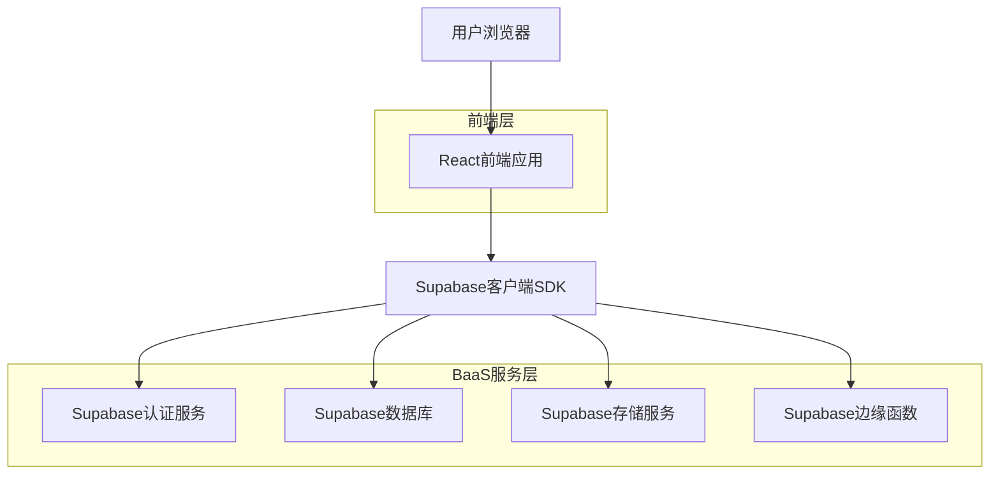
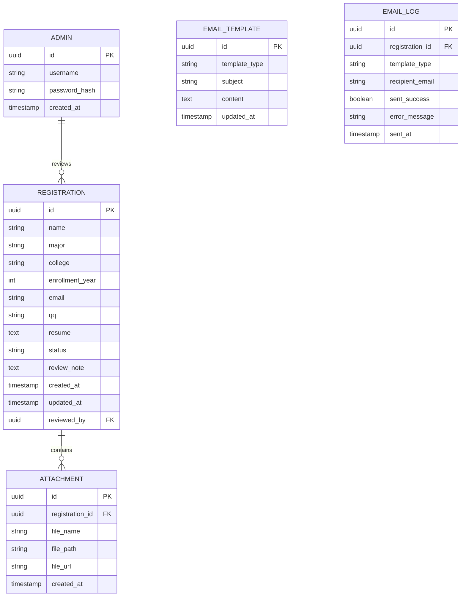

## 1. 架构设计



## 2. 技术描述

- **前端**：React@18 + TypeScript + TailwindCSS@3 + Vite
- **初始化工具**：vite-init
- **后端**：无（使用Supabase BaaS服务）
- **认证**：Supabase Auth
- **数据库**：Supabase PostgreSQL
- **存储**：Supabase Storage
- **邮件服务**：Supabase Edge Functions + 邮件API

## 3. 路由定义

| 路由 | 用途 |
|-------|---------|
| / | 首页，展示报名须知和报名入口 |
| /register | 报名表单页面 |
| /admin/login | 管理员登录页面 |
| /admin/dashboard | 报名管理后台主页 |
| /admin/registrations | 报名列表页面 |
| /admin/registrations/:id | 报名详情页面 |
| /admin/email-templates | 邮件模板设置页面 |

## 4. 数据库设计

### 4.1 数据模型定义



### 4.2 数据定义语言

```sql
-- 报名表
CREATE TABLE registrations (
    id UUID PRIMARY KEY DEFAULT gen_random_uuid(),
    name VARCHAR(100) NOT NULL,
    major VARCHAR(100) NOT NULL,
    college VARCHAR(100) NOT NULL,
    enrollment_year INTEGER NOT NULL,
    email VARCHAR(255) NOT NULL,
    qq VARCHAR(50) NOT NULL,
    resume TEXT NOT NULL,
    status VARCHAR(20) DEFAULT 'pending' CHECK (status IN ('pending', 'approved', 'rejected')),
    review_note TEXT,
    reviewed_by UUID REFERENCES auth.users(id),
    created_at TIMESTAMP WITH TIME ZONE DEFAULT NOW(),
    updated_at TIMESTAMP WITH TIME ZONE DEFAULT NOW()
);

-- 附件表
CREATE TABLE attachments (
    id UUID PRIMARY KEY DEFAULT gen_random_uuid(),
    registration_id UUID NOT NULL REFERENCES registrations(id) ON DELETE CASCADE,
    file_name VARCHAR(255) NOT NULL,
    file_path VARCHAR(500) NOT NULL,
    file_url VARCHAR(500) NOT NULL,
    created_at TIMESTAMP WITH TIME ZONE DEFAULT NOW()
);

-- 邮件模板表
CREATE TABLE email_templates (
    id UUID PRIMARY KEY DEFAULT gen_random_uuid(),
    template_type VARCHAR(50) UNIQUE NOT NULL CHECK (template_type IN ('approved', 'rejected')),
    subject VARCHAR(255) NOT NULL,
    content TEXT NOT NULL,
    updated_at TIMESTAMP WITH TIME ZONE DEFAULT NOW()
);

-- 邮件发送记录表
CREATE TABLE email_logs (
    id UUID PRIMARY KEY DEFAULT gen_random_uuid(),
    registration_id UUID NOT NULL REFERENCES registrations(id),
    template_type VARCHAR(50) NOT NULL,
    recipient_email VARCHAR(255) NOT NULL,
    sent_success BOOLEAN NOT NULL,
    error_message TEXT,
    sent_at TIMESTAMP WITH TIME ZONE DEFAULT NOW()
);

-- 创建索引
CREATE INDEX idx_registrations_status ON registrations(status);
CREATE INDEX idx_registrations_email ON registrations(email);
CREATE INDEX idx_attachments_registration_id ON attachments(registration_id);
CREATE INDEX idx_email_logs_registration_id ON email_logs(registration_id);

-- 初始化邮件模板
INSERT INTO email_templates (template_type, subject, content) VALUES 
('approved', 'ICPC校赛报名审核通过', '恭喜您！您的ICPC校赛报名已经审核通过。'),
('rejected', 'ICPC校赛报名审核结果', '很抱歉，您的ICPC校赛报名未通过审核。');

-- 权限设置
GRANT SELECT ON registrations TO anon;
GRANT INSERT ON registrations TO anon;
GRANT SELECT ON attachments TO anon;
GRANT INSERT ON attachments TO anon;

GRANT ALL PRIVILEGES ON registrations TO authenticated;
GRANT ALL PRIVILEGES ON attachments TO authenticated;
GRANT ALL PRIVILEGES ON email_templates TO authenticated;
GRANT ALL PRIVILEGES ON email_logs TO authenticated;
```

## 5. Supabase配置

### 5.1 存储桶配置
- 创建存储桶：registration-attachments
- 允许公开读取
- 设置文件大小限制：5MB
- 允许的文件类型：image/*

### 5.2 边缘函数
```typescript
// send-batch-emails
import { createClient } from '@supabase/supabase-js'

export async function sendBatchEmails(registrationIds: string[], templateType: 'approved' | 'rejected') {
    // 获取邮件模板
    // 批量发送邮件
    // 记录发送日志
}
```

## 6. 环境变量配置

```env
# Supabase配置
VITE_SUPABASE_URL=your_supabase_url
VITE_SUPABASE_ANON_KEY=your_supabase_anon_key

# 管理员配置
VITE_ADMIN_USERNAME=admin
VITE_ADMIN_PASSWORD_HASH=hashed_password

# 邮件服务配置（可选）
EMAIL_API_KEY=your_email_service_key
EMAIL_API_URL=your_email_service_url
```

## 7. 部署步骤

### 7.1 准备工作
1. 注册Supabase账号并创建项目
2. 注册Vercel账号
3. 准备GitHub仓库

### 7.2 数据库初始化
1. 在Supabase控制台执行DDL语句
2. 配置存储桶和权限
3. 设置边缘函数

### 7.3 前端部署
1. 连接GitHub仓库到Vercel
2. 配置环境变量
3. 一键部署

### 7.4 验证部署
1. 测试前端访问
2. 验证数据库连接
3. 测试图片上传功能
4. 验证